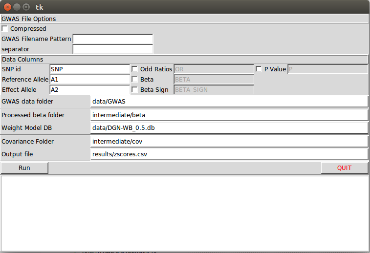

# MetaXcan

MetaXcan: summary statistics based gene-level association test

# Software Description

This repository contains software for implementing and/or using MetaXcan method.
Most of it is implemented at [Python](https://www.python.org/) scripts, 
although there are some [R](https://www.r-project.org/) scripts for processing and plotting results.

Most scripts were written as reusable components in a software library,
aimed at building different processing workflows.

Some of them, however, can be executed as command line tools to perform MetaXcan computations.

Check the root [Readme](https://github.com/hakyimlab/MetaXcan) for a sample script usage.

## Prerequisites

The software is developed and tested in Linux and Max OS environments. Should be mostly working on Windows.

You need [Python 2.7](https://www.python.org/) and [numpy](http://www.numpy.org/) to run MetaXcan.
Some support scripts use [scipy](http://www.scipy.org/) too.

[R](https://www.r-project.org/) with [ggplot](http://ggplot2.org/) and [dplyr](https://cran.r-project.org/web/packages/dplyr/index.html) 
is needed for some optional statistics and charts.

# Overview

MetaXcan is concerned with obtaining gene-level association tests from ordinary GWAS data.

Ordinarily, a user would need to obtain/download support data sets comprising of:
- A Transcriptome Prediction Model database (an example is [here](https://s3.amazonaws.com/imlab-open/Data/MetaXcan/1000G-WB/data/DGN-WB_0.5.db))
- A file with the covariance matrices of the SNPs within each gene model (such as [this one](https://s3.amazonaws.com/imlab-open/Data/MetaXcan/1000G-WB/intermediate/covariance.txt.gz))

And use them to run MetaXcan analysis on:
- GWAS results (such as [these](https://s3.amazonaws.com/imlab-open/Data/MetaXcan/1000G-WB/data/GWAS.tar.gz))

However, if you have access to interesting data,
you can build your own Transcriptome Prediction Model database 
(using tools such as [PredictDB](https://github.com/hakyimlab/PrediXmod/tree/master/PredictDB)), 
and your own covariance (using tools from this repository).

More detailed information can be found at the [Wiki](https://github.com/hakyimlab/MetaXcan/wiki),
where more specific coverage is given to the tools contained here.

# Brief Tour

Scripts **M00_prerequisites.py**, **M01_covariances_correlations.py**, **M02_variances.py**, **M03_betas.py**
and **M04_zscores.py** are steps in a MetaXcan pipeline, although tipically a user will only need to
use the last three. For ease of use, there is a script that performs these last two steps at once, **MetaXcan.py**.
There is also a GUI app, **MetaXcanUI.py**, that offers a simplified operation for **MetaXcan.py**'s functionality.

All of these runable scripts take different number of command line parameters. Run them with
**--help** option to see the options.

## M00_prerequisites.py

This script takes extensive genotype data sets such as Thousand Genomes Haplotypes 
([here](https://mathgen.stats.ox.ac.uk/impute/1000GP%20Phase%203%20haplotypes%206%20October%202014.html))
allows for some filtering based on population or ID, and selects those entries
present in hapmap2 biallelic SNP's.

It supports input and output into a custom format that we call internally "PrediXcan Format". It is composed of
gzip compressed textfiles, without headers, where each row contains:

```bash
chromosome SNP_id SNP_position reference_allele effect_allele allele_frequency ...
# "..." stands for allele dosage data, one value per sample individual, value in [0, 2]
```

It is assumed that a "samples file" is provided, describing each sample individual's metadata, which is a plain text file
that looks like:

```bash
ID POP GROUP SEX
HG00096 GBR EUR male
HG00097 GBR EUR female
HG00099 GBR EUR female
HG00100 GBR EUR female
HG00101 GBR EUR male
HG00102 GBR EUR female
...
```
This script is hardly ever necessary. You might use it occasionally to reduce file sizes
used at the covariance script step (**M01_covariances_correlations.py**).

## M01_covariances_correlations.py

This script builds the covariance matrices needed at **M04_zscores.py**.
You will run it once in a while, if ever.
It takes input from **M00_prerequisites.py**'s output, and a genetic expression model database, such as
[this one](https://s3.amazonaws.com/imlab-open/Data/MetaXcan/1000G-WB/data/DGN-WB_0.5.db).

It will build the correlation matrix between SNP's in a same gene's model, for each gene, and save them
in a gzip-compressed text file.

## M03_betas.py

This is an optional script that takes GWAS results and converts them into a format that **M04_zscores.py**
can understand, and filters down snps by removing those excluded from the genetic expression.
If you use tools such as [Plink](https://www.cog-genomics.org/plink2), you will need to do this.

This supports both compressed and uncompressed text files as input. When running this script,
you need to specify the column names of expected data. We recommend files that include SNP's GWAS results for
(*beta* or *odd ratio* or *sign of beta*) and p-value. So that, for example, you provide **-or_column** and **--pvalue_column**
when running it.

## M04_zscores.py

This performs the actual MetaXcan calculation. It needs a genetic expression model database,
the covariance matrices from this model measured on a specific population, and GWAS data
as in the output of **M03_betas.py**.

If you have the model database and covariance matrix, you can just call this at the end
of your gwas pipeline (optionally using **M03_betas.py**).

## MetaXcan.py

Thin wrapper over **M03_betas.py** and **M04_zscores.py**; it is merely a convenience for running the most usual of MetaXcan's steps in a single command.

## MetaXcanUI.py

This script launches a desktop app that processes GWASinput and produces MetaXcan association results.
It is basically a friendlier way to use functionality at **M03_betas.py** and **M04_zscores.py**.
It doesn't support all of the options these scripts do (that as a matter of fact haven't been covered in this readme)
but might be friendlier to non technical users.

Here is a screenshot:


## MetaMany

MetaMany: Perform MetaXcan on multiple tissues serially in a single command

### Differences from standard MetaXcan parameter set

MetaMany was written to simplify the execution of multiple MetaXcan runs where the user is 
interested in looking at multiple tissues. In order to facilitate this in the most convenient
manner, MetaMany's argument set is slightly different than those of the regular program:

#### --weight_db_path doesn't exist in MetaMany
 
Unlike MetaXcan proper, the user points directly to one or more weight databases
directly on the command line with no argument prefix. The program will iterate over each of these
in serial fashion and perform the same analysis that would have been performed had the user done
each individually using MetaXcan. 

#### --covariance is now --covariance_directory in MetaMany

Rather than specifying a single covariance file, users must specify a single directory and MetaMany 
will look for a matching covariance file inside that directory. To find a matching covariance file, 
MetaMany strips the tissue database filename of the ".db" extension and replaces it with 
".cov.txt.gz". If such a file is not found, the program will halt and an error will be reported. 

#### --output_file is now --output_directory in MetaMany

Rersults are written to the directory specified by --output_directory under the filename similar to
the tissue database where the ".db" extension is replaced by ".csv". 


### MetaMany Import Note

This script is based on MetaXcan.py, with chances necessary for running the anlaysis over multiple 
tissues in serial fashion. In order for this script to work, there is a major assumption about the 
file arrangement of the tissue databases and covariates:

**Databases and covariates must be named identically except for extentions (as can be seen in the 
current version of the GTEX tissue databases). The script allows for separate directories for
each of the two types of data, but they must be named identically up to a certain point. For 
instance, CrossTissue_elasticNet0_0.5.db has a corresponding covariance file named 
CrossTissue_elasticNet0_0.5.cov.txt.gz.**

### Example MetaMany Statement

The following command line would perform typical MetaXcan analysis on for the output in GWAS_Results 
for each of the tissues starting with TW_Brain_ inside the GTEx-2016-02-29 directory. It will look
inside the directory GTEx-2016-02-29/covariances/0.5 for appropriate covariance files for each 
of the databases. Results would be written to the directory, results, with similar file names as each
of the corresponding databases. 

```bash
$ MetaMany.py  \
    --gwas_folder GWAS_Results/ \
    --beta_column beta \
    --pvalue_column p \
    --se_column se \
    --frequency_column maf \
    --snp_column markername \
    --a1_column effect_allele \
    --a2_column other_allele\
    --covariance_directory GTEx-2016-02-29/covariances/0.5/ \
    --output_directory results \
    GTEx-2016-02-29/TW_Brain*.db
```


## Useful Data

We make available several GTEx tissue models and 1000 Genomes covariances [here](https://app.box.com/s/gujt4m6njqjfqqc9tu0oqgtjvtz9860w).
This files should be enough for running **M03_betas.py** and **M04_zscores.py** on practically any GWAS study.

## The Rest

The other scripts in this repository fall into two categories:
* components to be used by runnable scripts (such as the ones just described) 
* Support data processing and analysis

# What do I do with this stuff?

It depends on your needs and means.

Ordinarily, most users would need to download some genetic expression databases,
some covariance matrices, and run MetaXcan on GWAS studies.
The **GUI**,  **M03_betas.py**, **M04_zscores.py** and **MetaXcan.py**
can be used for that.

A more sophisticated application could include using MetaXcan
with custom expression model databases, and different population's covariance matrices.
**M00_prerequisites.py** and **M01_covariances_correlations.py** can help with that.

A yet more sophisticated use would imply using and modifying the source code
to build custom processing pipelines.

If curious, check the [Wiki](https://github.com/hakyimlab/MetaXcan/wiki) for further information.

